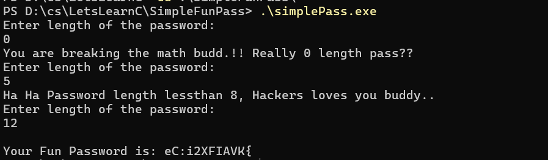
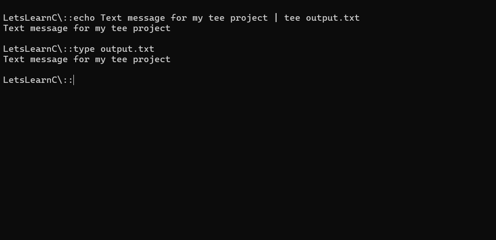
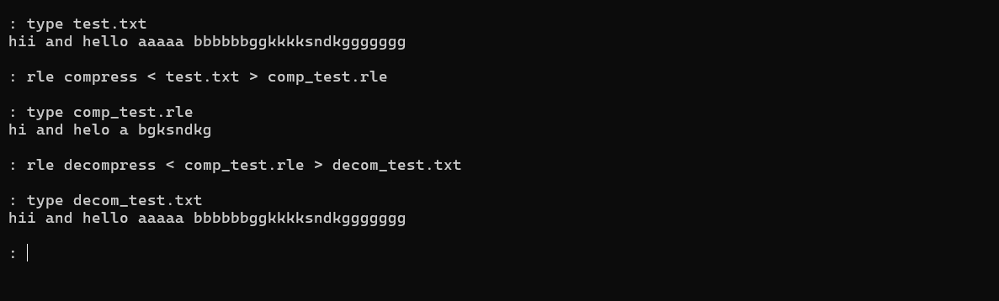

# 🔥 LetsLearnC
### *raw code. zero mercy. maximum fun.*

---

```
  ██████╗
 ██╔════╝
 ██║
 ██║
 ╚██████╗
  ╚═════╝  ← the language that built everything you love
```

> **"Everyone's out here vibe-coding. I want to know what's underneath the vibe."**

---

## 🤔 Why Am I Doing This?

Okay real talk.

We're living in the **AI era**. LLMs write code. Copilot finishes your sentences. You can vibe-code an entire app in an afternoon without touching a semicolon.

And I think that's *awesome* — but also kinda terrifying if you don't understand what's happening underneath.

So I went back to the basement. The **foundation**. The thing that built Linux, Python, Git, and basically every piece of software that exists on this planet.

**C.**

No garbage collector. No hand-holding. You want memory? You ask for it. You done with it? You free it (or you don't, and things explode — which is honestly a great way to learn).

Here's why C hits different :

- 🧠 **Understand what AI-generated code is actually doing** at the system level
- ⚡ **Pointers, memory, stack vs heap** — stuff most devs wave their hands at
- 🔩 **Get close to the metal** — like, embarrassingly close
- 💀 **Segfaults build character** (they really do)
- 🎯 **When you understand C, everything else makes sense**

This isn't a bootcamp. There's no certificate at the end. This is just me, a compiler, and a terminal — figuring it out one project at a time.

---

## 📁 What's In Here

Each folder = one project = one step forward.

Every project has:
- 📄 A `.c` file (the actual code, no fluff)
- 🖼️ A screenshot of it running (proof it works lol)
- A quick description below of what I learned

---

## 🗂️ Projects

> *More dropping as I go. This repo grows with me.*

---

### 📦 `SimpleFunPass`
**The Simple Fun Way To Generate Passwords..!!**

**What it does:** You give it a number. It gives you a chaotic, beautiful, unhinged password. You're welcome.

**So for project #1**, instead of printing "Hello World" like a boring person, I built a **random password generator** — because security is literally my thing and also because it forced me to actually *use* C concepts right away instead of just vibing with `printf`.





---

### 📦 `StupidFunEncrypt/` — *The Stupidly Genius Encryptor* 🔐💀

**What it does:** Takes anything you throw at it — text, files, your secrets, your enemies' secrets — and scrambles it with a key. Run it again with the same key? Unscrambled. It's encryption. Stupid, beautiful, raw encryption.

```bash
echo "hello hacker" | ./stupidFunEncrypt mykey
# outputs: cursed gibberish 🗿

echo "hello hacker" | ./stupidFunEncrypt mykey | ./stupidFunEncrypt mykey  
# outputs: hello hacker 👻
```


This one hit different. Because this isn't just a fun program — this is **how real encryption actually works at the bit level**. XOR is literally inside AES, inside TLS, inside every secure connection your browser makes right now. And here it is, naked, in 20 lines of C.


Is this cryptographically secure? Absolutely not 😂  
Is this how XOR ciphers work at the metal level? **100% yes.**  
Did I learn more about bits, memory, and pointers from this than from any YouTube tutorial? **Without question.**

---


### 📦 `StupidTee/` — *The Clone That Does Two Things At Once* 🪄📄

**What it does:** You type (or pipe) something in — it prints it to your terminal AND saves it to a file. Simultaneously. Like the Unix `tee` command. Except you built it yourself from scratch in C.

```bash
echo "i built this" | ./stupidTee output.txt
# prints to screen AND saves to output.txt at the same time 🤯
```


This project is lowkey one of the most *practical* things you can build early in C because it touches **File I/O** — the thing that makes programs actually interact with the real world beyond just the terminal.


Unix has a `tee` command that does exactly this. It's been in Linux since forever.  
You just rebuilt it. In C. From scratch.  
That's not a beginner project anymore. That's systems programming. 🔩

 Fun Fact: The command is literally named after a T-shaped plumbing pipe — the one that splits water flow into two directions. One stream in, two streams out. Terminal and file. A 1970s Unix developer looked at a pipe fitting and said "yeah that's the one" and honestly that's the most C programmer thing ever. 


---

### 📦 `BaseRLE/` — *Zip Who? I Built My Own* 🗜️

**What it does:** Compresses and decompresses data using **Run-Length Encoding** — the same algorithm used in old bitmap images, fax machines, and early game sprites.

```bash
echo "AAAAAABBBCC" | ./stupidCompress compress | ./stupidCompress decompress
# back to: AAAAAABBBCC
```

You just built a compression algorithm. Not used one. **Built one.** `zlib` is shaking.

RLE is dead simple — instead of storing `AAAAAAA` it stores `A7`. That's it. That's compression. And this project implements both directions: squeeze it down, blow it back up — perfectly.



---

> 🚧 *More projects incoming. Each one is a new unlock.*


---

## 🧭 The Road (Roughly)

```
[START] Hello World
   ↓
Variables & Types
   ↓
Control Flow (if/else/loops)
   ↓
Functions
   ↓
Arrays & Strings
   ↓
Pointers 😱
   ↓
Memory Management (malloc/free)
   ↓
File I/O
   ↓
Structs
   ↓
[???] Something actually cool
```

No deadlines. No pressure. Just vibes and segfaults.

---

## 🛠️ How To Run Any Project

```bash
# clone the repo
git clone https://github.com/ykverse/LetsLearnC.git
cd LetsLearnC

# pick a project
cd <filename>

# compile it
gcc main.c -o main

# run it
./main
```

You'll need `gcc` installed. If you don't have it:
```bash
# Linux/macOS
sudo apt install gcc       # Debian/Ubuntu
brew install gcc           # macOS

# Windows: install MinGW or WSL, you'll figure it out
```

---

## 📌 Ground Rules I Set For Myself

1. **No copy-pasting code I don't understand.** Every line gets read.
2. **Break things on purpose.** Mess with the code, see what happens.
3. **Comment like future-me is confused** (because he will be).
4. **Screenshots are mandatory.** If it ran, it gets documented.
5. **Have fun or what's the point.**

---

## 🙋 Who Am I?

I'm **yk** — CS student, cybersecurity nerd, graphic designer, and someone who decided that the best way to understand modern computing is to go back to 1972 and start from scratch.

Find me breaking things here: [@ykverse](https://github.com/ykverse)

---

<div align="center">

**made with ❤️, gcc, and a concerning number of segfaults**

*"The best way to understand the machine is to speak its first language."*

⭐ Star this if you're also on this journey. We're in this together.

</div>


